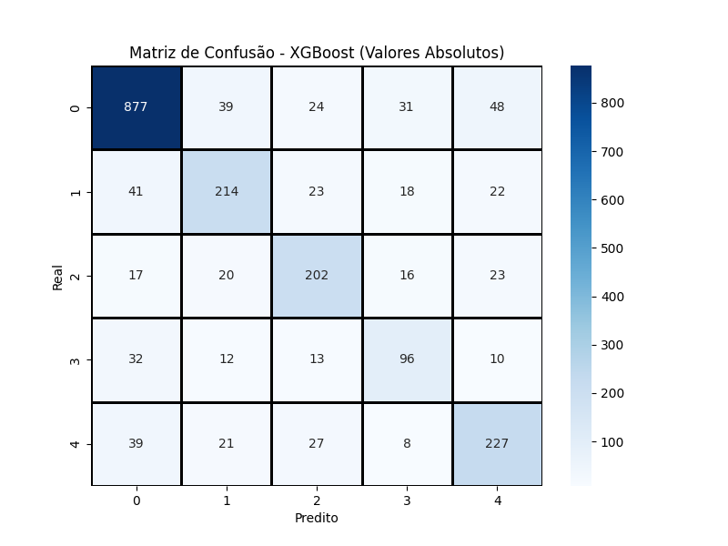

# Exoplanet Classification - ONIA 2024 🪐🚀

*(Português abaixo)*

Professional machine learning pipeline developed for the **1st National Artificial Intelligence Olympiad (ONIA)**. This project implements advanced ensemble techniques, hyperparameter tuning, and data balancing to classify habitability metrics in unknown planetary systems.

## 📊 Performance Results
* **Optimized XGBoost (GridSearchCV):** **91.87% F1-Score** (Weighted)
* **Stacking Ensemble (Baseline):** 79.07% F1-Score
* **Status:** `predicoes.csv` successfully generated for final submission.

## 🛠️ Technical Stack & Advanced Methods
* **Machine Learning:** Scikit-Learn, XGBoost, LightGBM.
* **Class Imbalance:** Applied **SMOTE** to ensure model fairness across all 5 classes.
* **Model Architecture:** **Stacking Classifier** (Ensemble) and **XGBoost** optimized via **GridSearchCV**.
* **Software Engineering:** Implementation of dynamic path handling (`os` library) for cross-environment portability.

## 🚀 How to Run
1. Clone this repository.
2. Ensure `treino.csv` and `teste.csv` are in the same directory as the script.
3. Install the complete dependency list:
    ```bash
    pip install -r requirements.txt
    ```
4. Run the main script:
    ```bash
    python desafiooniafinalizado.py
    ```

## 🧠 Technical Evolution & Comparison
This repository documents the evolution from simple linear models to complex architectures. 

### Model Improvement (v1 vs v2)
| Baseline Matrix (2024) | Optimized Matrix (v2 - 2026) |
| :---: | :---: |
|  |  |

> **Analysis:** The current version (v2) achieved a **91.87% F1-Score**, significantly outperforming the 2024 baseline. The use of **SMOTE** corrected class imbalance, while **GridSearchCV** fine-tuned the XGBoost parameters for maximum precision in the minority classes.

---

# Classificação de Exoplanetas - ONIA 2024 🪐🚀

Pipeline profissional de Machine Learning desenvolvido para a **1ª Olimpíada Nacional de Inteligência Artificial (ONIA)**. O projeto implementa técnicas avançadas de ensemble, ajuste de hiperparâmetros e balanceamento de dados para classificação de métricas de habitabilidade em sistemas planetários desconhecidos.

## 📊 Resultados de Performance
* **XGBoost Otimizado (GridSearchCV):** **91.87% de F1-Score** (Weighted)
* **Stacking Ensemble (Baseline):** 79.07% de F1-Score
* **Status:** Arquivo `predicoes.csv` gerado com sucesso para submissão final.

## 🛠️ Tecnologias e Métodos Avançados
* **Machine Learning:** Scikit-Learn, XGBoost, LightGBM.
* **Tratamento de Dados:** Aplicação de **SMOTE** para balanceamento de classes minoritárias e **StandardScaler** para normalização.
* **Arquitetura:** **Stacking Classifier** (Ensemble) e **XGBoost** de alta performance.
* **Otimização:** Busca exaustiva de hiperparâmetros via **GridSearchCV** (K-Fold).
* **Engenharia de Software:** Gerenciamento dinâmico de diretórios para garantir portabilidade entre diferentes ambientes.

## 🚀 Como Executar
1. Clone este repositório.
2. Certifique-se de que os arquivos `treino.csv` e `teste.csv` estejam no mesmo diretório.
3. Instale as dependências: `pip install -r requirements.txt`
4. Execute: `python desafiooniafinalizado.py`

## 🧠 Evolução Técnica e Comparação
Este repositório documenta a evolução de modelos simples para arquiteturas robustas. 

### Melhoria do Modelo (v1 vs v2)
A tabela abaixo demonstra visualmente o ganho de performance entre o modelo inicial e o atual:

| Matriz Baseline (2024) | Matriz Otimizada (v2 - 2026) |
| :---: | :---: |
|  |  |

> **Análise Técnica:** A versão atual (v2) atingiu **91.87% de F
